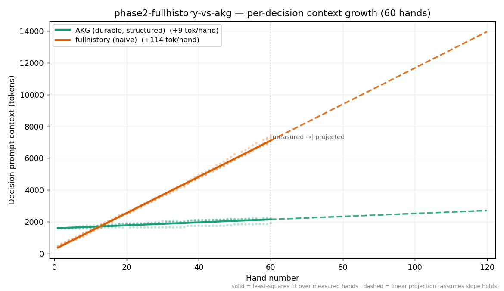

# Experiment: phase2-fullhistory-vs-akg

**Hypothesis:** Phase 2 full-history bracket: the naive strategy of stuffing all prior hands verbatim into the context window (llm-fullhistory) versus a typed, queryable AKG graph (llm-akg-durable), heads-up and seat-mirrored across 2 seeds (4 sessions). OBSERVATIONAL: we measure (1) profile-fidelity drift — cross-validate each agent's stated opponent reads against engine ground truth; (2) honest TOTAL token cost. Full-history grows the context linearly with hand count; its breaking point (context ceiling, cost runaway, or fidelity collapse) is itself the finding. Horizon is 60 hands — beyond that full-history token cost becomes prohibitive. Chip outcomes are DIAGNOSTIC ONLY.

## Per-Session Results

| Group | Session | Seed | Seat 0 | Seat 1 | Chips Δ | Chips/hand | Duration (s) | Preflop-only | Showdown |
|---|---|---:|---|---|---:|---:|---:|---:|---:|
| group-0 | akg-vs-fullhistory-1 | 1 | llm-akg-durable [llm-akg-durable/0.1.0] | llm-fullhistory [llm-fullhistory/0.1.0] | +252 | 4.20 | 1344 | 38.3% | 10.0% |
| group-0 | akg-vs-fullhistory-2 | 2 | llm-akg-durable [llm-akg-durable/0.1.0] | llm-fullhistory [llm-fullhistory/0.1.0] | +400 | 6.67 | 2076 | 38.3% | 10.0% |
| group-1 | fullhistory-vs-akg-1 | 1 | llm-fullhistory [llm-fullhistory/0.1.0] | llm-akg-durable [llm-akg-durable/0.1.0] | +259 | 4.32 | 1339 | 46.7% | 5.0% |
| group-1 | fullhistory-vs-akg-2 | 2 | llm-fullhistory [llm-fullhistory/0.1.0] | llm-akg-durable [llm-akg-durable/0.1.0] | -68 | -1.13 | 1623 | 48.3% | 16.7% |

<!-- BEGIN eval-analysis -->

## Token cost & fidelity

*Observational. Generated 2026-06-08 from the live `phase2-fullhistory-vs-akg` sessions. Model: anthropic:claude-sonnet-4-6.*

> Across **60 identical hands**, the two memory strategies produced agents whose per-decision context **diverged**: the naive agent's prompt grew **+114 tok/hand** versus AKG's **+9** — **12.3× faster**. Total spend was **1.07×** ($8.61 vs $8.01).

**Framing.** Both agents run identical rules, identical tools, identical model — the *only* difference is the memory substrate. AKG keeps a typed, queryable graph it edits in small deltas; the naive agent rewrites free-form notes / re-injects history. Both SDKs are deliberately minimal and leave strategy to the implementer; this is a measurement, not a pitch.

## Per-decision context growth (the headline)

Decision prompt context = `input + cacheRead + cacheWrite` of each decision call. Slope is least-squares growth per hand.

| Agent | Decisions | Slope (tok/hand) | Early → late prompt |
|---|---:|---:|---:|
| akg durable | 223 | **+9.3** | 1,591 → 2,080 |
| fullhistory (naive) | 220 | **+114.3** | 722 → 6,864 |

The naive agent's per-decision context grows **12.3× faster**. Structured deltas keep most of the prompt stable across turns, which also happens to be cache-friendly; rewriting notes or re-injecting history does not.

## Total cost at this horizon

| Agent | Total tokens | Total $ |
|---|---:|---:|
| akg durable | 3,741,970 | $8.01 |
| fullhistory (naive) | 4,354,750 | $8.61 |

At **60 hands the total cost is ≈tied** (1.07×) — and that is the trap. AKG front-loads a fixed per-hand memory-maintenance cost that roughly cancels the naive agent's prompt bloat at short horizons. The slopes above show the gap only widens: the longer the agent runs, the worse the naive curve gets. See the projection in the chart.

## Fidelity

Only `llm-akg-durable` keeps structured, machine-checkable per-hand records, so it is the only agent this tool can cross-validate against ground truth. The naive agent's memory is free-form prose / raw history — **not structured-auditable**: in production you could not verify what it "remembers" either. A manual spot-check of the naive agent's notes is below where available.

> _Manual fidelity pass pending — see `phase2-fullhistory-vs-akg-fidelity-manual.md`._

## Cost trajectory



Solid = least-squares fit over measured hands. Dashed = linear projection past the measured horizon (assumes the slope holds). Don't trust the projection? Run it yourself — see *Reproduce* below.

## What this does and does not show

- **Scope:** 4 sessions, single model (anthropic:claude-sonnet-4-6), seat-mirrored across 60 planned hands. Not a claim about all workloads or models.
- **Chips are diagnostic only.** Heads-up variance over this few hands is large; the per-session table above is a sanity check, not a result.
- **Fidelity is measured only where structured records exist.** Prose / history-stuffing agents are not machine-auditable here (that is itself a finding).
- **The projection is extrapolation,** not data — clearly dashed, and reproducible at any horizon (below).

## Reproduce / extend this

Everything here regenerates from checked-in artifacts. Public repo, no hidden config.

```bash
# re-run the experiment (any horizon: edit hands_per_session first)
# research/experiments/phase2-fullhistory-vs-akg/phase2-fullhistory-vs-akg.json
poker experiment go phase2-fullhistory-vs-akg

# regenerate this report + chart
python3 .claude/skills/eval-analysis/analyze.py phase2-fullhistory-vs-akg --tokens
```

<!-- END eval-analysis -->
