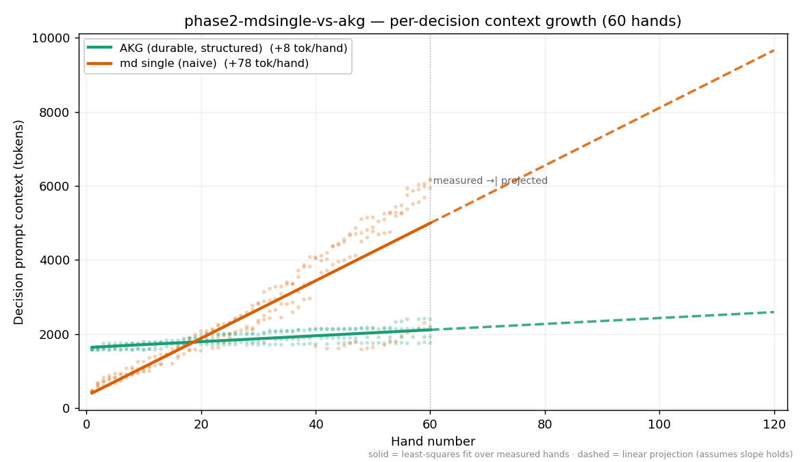

# Experiment: phase2-mdsingle-vs-akg

**Hypothesis:** Phase 2 single-file bracket: one freeform markdown file the model rewrites after each hand (llm-md-single) versus a typed, queryable AKG graph (llm-akg-durable), heads-up and seat-mirrored across 2 seeds (4 sessions) so positional and blind-rotation effects cancel. Both agents are model-maintained — each keeps its own memory current via its own LLM after every hand — so this isolates REPRESENTATION (one flat file vs a typed graph), not who writes the memory. OBSERVATIONAL: we measure (1) profile-fidelity drift — cross-validate each agent's stated opponent reads against engine ground truth in hands.jsonl; (2) honest TOTAL token cost — decision-prompt tokens PLUS post-hand update-session tokens. The single-file representation's distinctive cost is that it injects the whole file every decision and rewrites the whole file every update, so both grow with file size. Horizon is 60 hands — lower than wiki (150) to let single-file drift show without runaway cost. Chip outcomes are DIAGNOSTIC ONLY.

## Per-Session Results

| Group | Session | Seed | Seat 0 | Seat 1 | Chips Δ | Chips/hand | Duration (s) | Preflop-only | Showdown |
|---|---|---:|---|---|---:|---:|---:|---:|---:|
| group-0 | akg-vs-mdsingle-1 | 1 | llm-akg-durable [llm-akg-durable/0.1.0] | llm-md-single [llm-md-single/0.1.0] | +263 | 4.38 | 3502 | 55.0% | 10.0% |
| group-0 | akg-vs-mdsingle-2 | 2 | llm-akg-durable [llm-akg-durable/0.1.0] | llm-md-single [llm-md-single/0.1.0] | +400 | 6.67 | 2379 | 43.3% | 8.3% |
| group-1 | mdsingle-vs-akg-1 | 1 | llm-md-single [llm-md-single/0.1.0] | llm-akg-durable [llm-akg-durable/0.1.0] | +433 | 7.22 | 3087 | 53.3% | 11.7% |
| group-1 | mdsingle-vs-akg-2 | 2 | llm-md-single [llm-md-single/0.1.0] | llm-akg-durable [llm-akg-durable/0.1.0] | -39 | -0.65 | 3605 | 51.7% | 6.7% |

<!-- BEGIN eval-analysis -->

## Token cost & fidelity

*Observational. Generated 2026-06-08 from the live `phase2-mdsingle-vs-akg` sessions. Model: anthropic:claude-sonnet-4-6.*

> Across **60 identical hands**, the two memory strategies produced agents whose per-decision context **diverged**: the naive agent's prompt grew **+78 tok/hand** versus AKG's **+8** — **9.8× faster**. Total spend was **2.05×** ($16.80 vs $8.19).

**Framing.** Both agents run identical rules, identical tools, identical model — the *only* difference is the memory substrate. AKG keeps a typed, queryable graph it edits in small deltas; the naive agent rewrites free-form notes / re-injects history. Both SDKs are deliberately minimal and leave strategy to the implementer; this is a measurement, not a pitch.

## Per-decision context growth (the headline)

Decision prompt context = `input + cacheRead + cacheWrite` of each decision call. Slope is least-squares growth per hand.

| Agent | Decisions | Slope (tok/hand) | Early → late prompt |
|---|---:|---:|---:|
| akg durable | 217 | **+8.0** | 1,627 → 2,064 |
| md single (naive) | 222 | **+77.8** | 701 → 4,933 |

The naive agent's per-decision context grows **9.8× faster**. Structured deltas keep most of the prompt stable across turns, which also happens to be cache-friendly; rewriting notes or re-injecting history does not.

## Total cost at this horizon

| Agent | Total tokens | Total $ |
|---|---:|---:|
| akg durable | 3,900,921 | $8.19 |
| md single (naive) | 4,276,743 | $16.80 |

At **60 hands** the naive strategy costs **2.05×** as much for the same work. This is the slope above, compounded over the session — and the slope shows no sign of flattening.

## Fidelity

Only `llm-akg-durable` keeps structured, machine-checkable per-hand records, so it is the only agent this tool can cross-validate against ground truth. The naive agent's memory is free-form prose / raw history — **not structured-auditable**: in production you could not verify what it "remembers" either. A manual spot-check of the naive agent's notes is below where available.

**Manual fidelity pass.** `llm-md-single` keeps its memory as one free-form prose file
(`notes.md`), which is not machine-parseable the way AKG's typed records are — so this
was a hand audit. Every opponent-holding claim the agent wrote across all four sessions
was read out and cross-checked against engine ground truth (`hands.jsonl`): does the hand
the claim is attached to actually reach showdown, and do the stated cards match the cards
dealt?

| Session | Showdowns | Holdings recorded | Fabrications | Rank errors | Suit errors |
|---|---:|---:|---:|---:|---:|
| mdsingle-vs-akg-1 | 7 | 7 | 0 | 0 | 0 |
| mdsingle-vs-akg-2 | 4 | 4 | 0 | 0 | 0 |
| akg-vs-mdsingle-1 | 6 | 6 | 0 | 0 | 0 |
| akg-vs-mdsingle-2 | 5 | 3 | 0 | 0 | 1 |

- **Zero fabrications.** The agent never asserts a specific opponent holding on a hand that
  did not reach showdown — it reliably records "No showdown" where there was none. In
  showdown-only information mode, that is the sharpest possible fidelity-drift signal, and
  it never tripped.
- **Zero rank errors.** Every showdown holding it chose to record matches the cards dealt
  (e.g. H19 `5h 5d`, H33 `6h Qc`, H36 `Ts Kd`, H47 `8h Qd`, H55 `Kd 9c`).
- **One blemish:** in `akg-vs-mdsingle-2` hand 28 the agent logged the opponent's hand as
  "89s" (suited) when it was actually `8s 9c` (offsuit) — correct ranks, wrong suitedness.
  The only inaccuracy in the entire pass.

**Reading.** At 60 hands the single-file agent did **not** lose fidelity — it stayed
essentially perfectly accurate. So this bracket tells the same story as the wiki bracket:
at this horizon **fidelity is not the differentiator — cost is** (2.05× here). The
single-file rewrite approach is expected to drift at longer horizons; that is directly
testable by raising `hands_per_session` and re-running (see *Reproduce* below). We are
reporting what we measured, not what we expected.

## Cost trajectory



Solid = least-squares fit over measured hands. Dashed = linear projection past the measured horizon (assumes the slope holds). Don't trust the projection? Run it yourself — see *Reproduce* below.

## What this does and does not show

- **Scope:** 4 sessions, single model (anthropic:claude-sonnet-4-6), seat-mirrored across 60 planned hands. Not a claim about all workloads or models.
- **Chips are diagnostic only.** Heads-up variance over this few hands is large; the per-session table above is a sanity check, not a result.
- **Fidelity is measured only where structured records exist.** Prose / history-stuffing agents are not machine-auditable here (that is itself a finding).
- **The projection is extrapolation,** not data — clearly dashed, and reproducible at any horizon (below).

## Reproduce / extend this

Everything here regenerates from checked-in artifacts. Public repo, no hidden config.

```bash
# re-run the experiment (any horizon: edit hands_per_session first)
# research/experiments/phase2-mdsingle-vs-akg/phase2-mdsingle-vs-akg.json
poker experiment go phase2-mdsingle-vs-akg

# regenerate this report + chart
python3 .claude/skills/eval-analysis/analyze.py phase2-mdsingle-vs-akg --tokens
```

<!-- END eval-analysis -->
