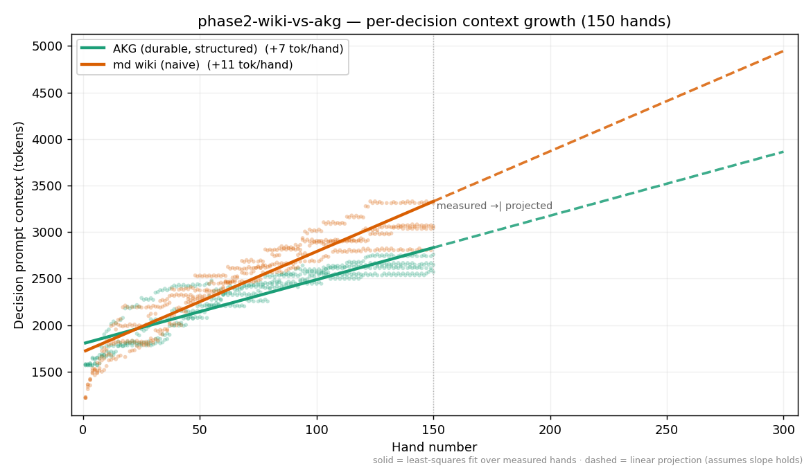

# Experiment: phase2-wiki-vs-akg

**Hypothesis:** Phase 2 linked-markdown bracket: a multi-file wiki where each page can link to others (llm-md-wiki) versus a typed, queryable AKG graph (llm-akg-durable), heads-up and seat-mirrored across 2 seeds (4 sessions). OBSERVATIONAL: we measure (1) profile-fidelity drift — cross-validate each agent's stated opponent reads against engine ground truth; (2) honest TOTAL token cost. Wiki grows with the number and size of linked pages; its cost curve is expected to be between flat AKG and linear full-history. Horizon is 150 hands — wiki is more token-efficient than single-file or full-history so we run it longer to observe fidelity drift at scale. Chip outcomes are DIAGNOSTIC ONLY.

## Per-Session Results

| Group | Session | Seed | Seat 0 | Seat 1 | Chips Δ | Chips/hand | Duration (s) | Preflop-only | Showdown |
|---|---|---:|---|---|---:|---:|---:|---:|---:|
| group-0 | akg-vs-wiki-1 | 1 | llm-akg-durable [llm-akg-durable/0.1.0] | llm-md-wiki [llm-md-wiki/0.1.0] | +517 | 3.45 | 8436 | 52.7% | 7.3% |
| group-0 | akg-vs-wiki-2 | 2 | llm-akg-durable [llm-akg-durable/0.1.0] | llm-md-wiki [llm-md-wiki/0.1.0] | +580 | 3.87 | 23105 | 49.3% | 6.7% |
| group-1 | wiki-vs-akg-1 | 1 | llm-md-wiki [llm-md-wiki/0.1.0] | llm-akg-durable [llm-akg-durable/0.1.0] | +395 | 2.63 | 11503 | 47.3% | 14.0% |
| group-1 | wiki-vs-akg-2 | 2 | llm-md-wiki [llm-md-wiki/0.1.0] | llm-akg-durable [llm-akg-durable/0.1.0] | +467 | 3.11 | 11015 | 55.3% | 8.7% |

<!-- BEGIN eval-analysis -->

## Token cost & fidelity

*Observational. Generated 2026-06-08 from the live `phase2-wiki-vs-akg` sessions. Model: anthropic:claude-sonnet-4-6.*

> Across **150 identical hands**, the two memory strategies produced agents whose per-decision context **diverged**: the naive agent's prompt grew **+11 tok/hand** versus AKG's **+7** — **1.6× faster**. Total spend was **2.04×** ($56.72 vs $27.87).

**Framing.** Both agents run identical rules, identical tools, identical model — the *only* difference is the memory substrate. AKG keeps a typed, queryable graph it edits in small deltas; the naive agent rewrites free-form notes / re-injects history. Both SDKs are deliberately minimal and leave strategy to the implementer; this is a measurement, not a pitch.

## Per-decision context growth (the headline)

Decision prompt context = `input + cacheRead + cacheWrite` of each decision call. Slope is least-squares growth per hand.

| Agent | Decisions | Slope (tok/hand) | Early → late prompt |
|---|---:|---:|---:|
| akg durable | 568 | **+6.9** | 1,691 → 2,641 |
| md wiki (naive) | 553 | **+10.8** | 1,609 → 3,080 |

The naive agent's per-decision context grows **1.6× faster**. Structured deltas keep most of the prompt stable across turns, which also happens to be cache-friendly; rewriting notes or re-injecting history does not.

## Total cost at this horizon

| Agent | Total tokens | Total $ |
|---|---:|---:|
| akg durable | 11,986,023 | $27.87 |
| md wiki (naive) | 20,707,783 | $56.72 |

At **150 hands** the naive strategy costs **2.04×** as much for the same work. This is the slope above, compounded over the session — and the slope shows no sign of flattening.

## Fidelity

Each agent's stated opponent reads were cross-validated against engine ground truth (`hands.jsonl`). **Fabrication** = a specific villain holding claimed on a hand that never reached showdown; **card/board error** = a claim that contradicts the cards actually shown.

| Agent | Records | Card claims | Fabrications | Card errors | Board errors |
|---|---:|---:|---:|---:|---:|
| akg durable | 35 | 7 | 0 | 0 | 0 |
| md wiki | 81 | 26 | 0 | 0 | 0 |

Both agents recalled their opponent with **zero hard-fact errors**. The extra spend buys no fidelity — same accuracy, more tokens.

## Cost trajectory



Solid = least-squares fit over measured hands. Dashed = linear projection past the measured horizon (assumes the slope holds). Don't trust the projection? Run it yourself — see *Reproduce* below.

## What this does and does not show

- **Scope:** 4 sessions, single model (anthropic:claude-sonnet-4-6), seat-mirrored across 150 planned hands. Not a claim about all workloads or models.
- **Chips are diagnostic only.** Heads-up variance over this few hands is large; the per-session table above is a sanity check, not a result.
- **Fidelity is measured only where structured records exist.** Prose / history-stuffing agents are not machine-auditable here (that is itself a finding).
- **The projection is extrapolation,** not data — clearly dashed, and reproducible at any horizon (below).

## Reproduce / extend this

Everything here regenerates from checked-in artifacts. Public repo, no hidden config.

```bash
# re-run the experiment (any horizon: edit hands_per_session first)
# research/experiments/phase2-wiki-vs-akg/phase2-wiki-vs-akg.json
poker experiment go phase2-wiki-vs-akg

# regenerate this report + chart
python3 .claude/skills/eval-analysis/analyze.py phase2-wiki-vs-akg --tokens
```

<!-- END eval-analysis -->
